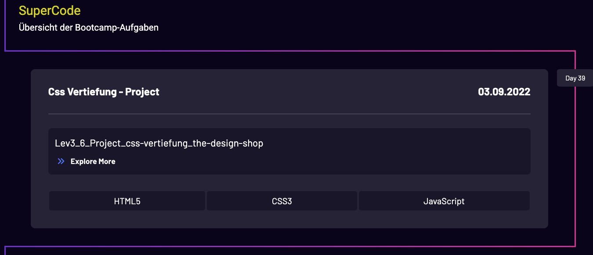

## Bootcamp - SuperCode

Um etwas mehr Ordnung in die Aufgaben zubekommen, habe ich diese alle in einen Ordner verpackt.

Die Aufgaben sind alle in dem Ordner `tasks`.

Diese sind nach Kurstage sortiert, dazu ist bei jeder Aufgabe eine separate Readme Datei.

In der Readme Datei ist die Aufgabenstellung + Link für mein Ergebnis.

## 📸 Screenshots

Dazu habe ich diese Übersichtsseite als Timeline erstellt:

## 💻 Running

Zur Seite —> - [Bootcamp-Aufgaben](https://mukkez.github.io/Bootcamp/)

<h3 align="left">Languages and Tools:</h3>

 

