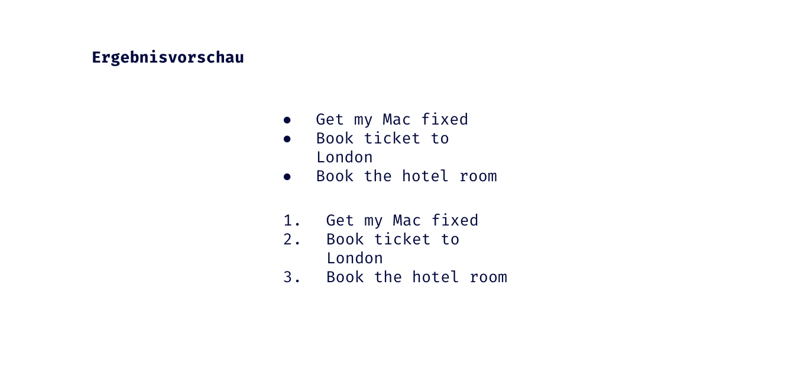

## HTML Einführung - Lev1_1_html-einfuehrung_list

Eine Übung im SuperCode Bootcamp

## 🎓 Aufgabe

Aufgabenstellung

Aufzählungslisten sind von Bedeutung, um z.B. Produkteigenschaften, Argumente für eine These oder einfach nur eine Einkaufsliste übersichtlich darzustellen.

Bitte erstelle zwei Todo-Listen:

- Unordered List
- Ordered List

## 💡 Hinweise

```bash
Nutze das HTML Element unordered list <ul>
Nutze das HTML Element ordered list <ol>
Code einrücken nicht vergessen ;)

```

## 📸 Screenshots



## 💻 Running

Zur Seite —> - [Lev1_1_html-einfuehrung_list](https://mukkez.github.io/Bootcamp/tasks/Day_03/Lev1_1_html-einfuehrung_list/)

<p align="left">
</p>

<h3 align="left">Languages and Tools:</h3>
<p align="left"> <a href="https://www.w3schools.com/html/" target="_blank" rel="noreferrer">  </a></p>
