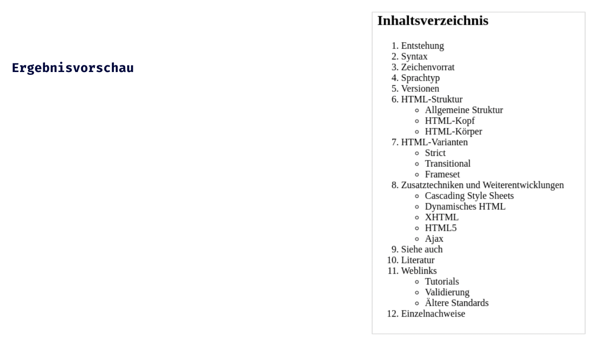

## HTML Einführung - Lev1_2_html-einfuehrung_list

Eine Übung im SuperCode Bootcamp

## 🎓 Aufgabe

Aufgabenstellung: Inhaltsverzeichnis und Listen

Listen sind sehr wichtig! Um das Erstellen von Listen zu üben, werden wir ein Inhaltsverzeichnis erstellen.

Eine perfekte Vorschau können wir noch nicht erreichen!
Schau dir die Ergebnisvorschau auf Folie 3 an!

## 💡 Hinweise

```
- Nutze das HTML Element unordered list <ul>
- Nutze das HTML Element ordered list <ol>
- Verschachtelte Listen
- Code einrücken nicht vergessen ;)
```

## 📸 Screenshots



## 💻 Running

Zur Seite —> - [Lev1_2_html-einfuehrung_list](https://mukkez.github.io/Bootcamp/tasks/Day_03/Lev1_2_html-einfuehrung_list/)

<p align="left">
</p>

<h3 align="left">Languages and Tools:</h3>
<p align="left"> <a href="https://www.w3schools.com/html/" target="_blank" rel="noreferrer">  </a></p>
