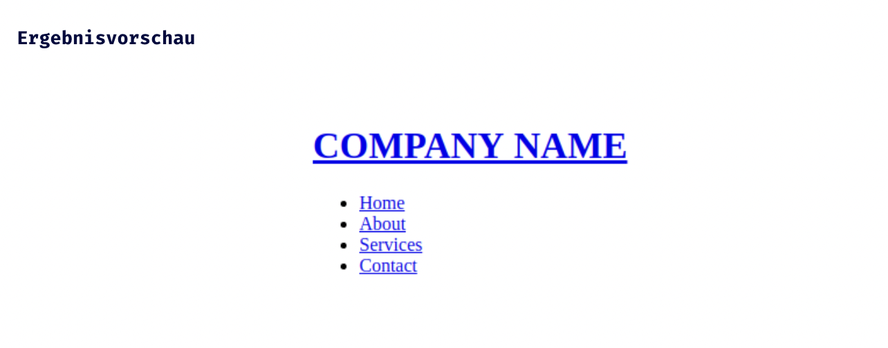

## HTML Einführung - Lev1_3_html-einfuehrung_navigation-listen-anchor

Eine Übung im SuperCode Bootcamp

## 🎓 Aufgabe

Jetzt, wo du ein Profi mit Listen bist schlage ich vor, dass
du eine Navigation erstellst.

```
- Nutze das HTML Element unordered list <ul>
- Nutze das HTML Element anchor tag <a>
- Das Logo (Company Name) ist anklickbar
```

## 💡 Hinweise

```
- Code einrücken nicht vergessen ;)
- Anstatt dem Namen des Unternehmens kann ein Logo aus dem Internet verwendet werden
- Logos und Bilder verwendet man über das “img” Tag. Beispiel: 

```

## 📸 Screenshots



## 💻 Running

Zur Seite —> - [Lev1_3_html-einfuehrung_navigation-listen-anchor](https://mukkez.github.io/Bootcamp/tasks/Day_03/Lev1_3_html-einfuehrung_navigation-listen-anchor/)

<p align="left">
</p>

<h3 align="left">Languages and Tools:</h3>
<p align="left"> <a href="https://www.w3schools.com/html/" target="_blank" rel="noreferrer">  </a></p>
