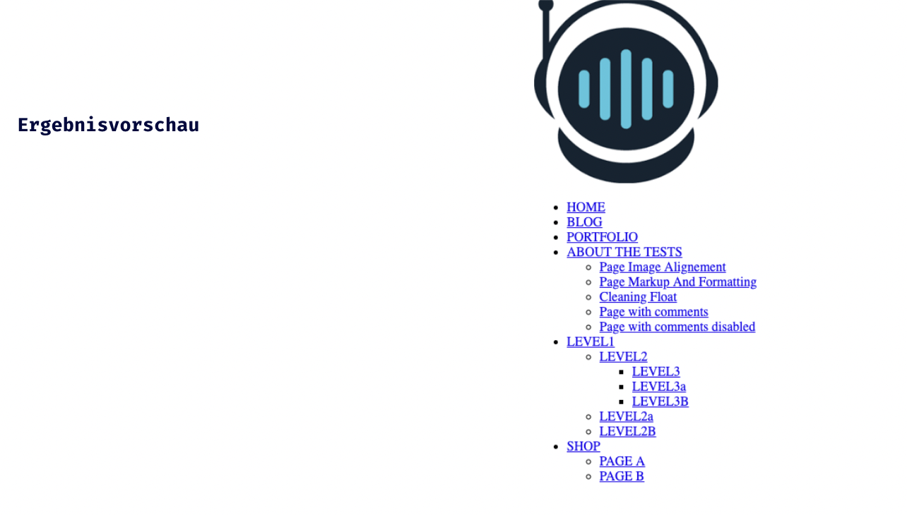

## HTML Einführung - Lev1_4_html-einfuehrung_navigation

Eine Übung im SuperCode Bootcamp

## 🎓 Aufgabe

Die letzte Navigation war ja ein Kinderspiel. ;)

Etwas komplizierter, aber mit etwas Organisation wirst du das schaffen.

## 💡 Hinweise

```
- Code einrücken (because if you don’t your colleagues will hate you)
- Das HTML Element unordered list <ul> benutzen
- Das HTML Element anchor <a> benutzen
- Verschachtelte Listen
- BONUS : Eventuell Logo (img) verwenden (Suche dir eins ;) )
```

## 📸 Screenshots



## 💻 Running

Zur Seite —> - [Lev1_4_html-einfuehrung_navigation](https://mukkez.github.io/Bootcamp/tasks/Day_03/Lev1_4_html-einfuehrung_navigation/)

<p align="left">
</p>

<h3 align="left">Languages and Tools:</h3>
<p align="left"> <a href="https://www.w3schools.com/html/" target="_blank" rel="noreferrer">  </a></p>
