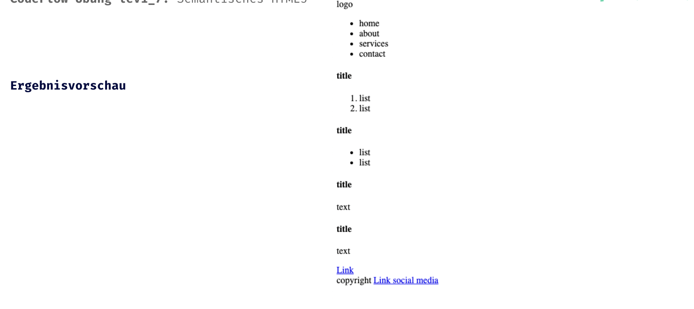

## HTML Einführung - Lev1_7_html-Einführung_semantisches-html5

Eine Übung im SuperCode Bootcamp

## 🎓 Aufgabe

Fast jedes HTML-Element hat eine festgelegte Bedeutung, mit der Inhalte auf einer Webseite versehen und damit gleichzeitig strukturiert werden.

Wenn für die verschiedenen Inhalte der Website das jeweils passende HTML-Element verwendet wird, spricht man von semantisch wertvollem Code. Eine professionelle Website muss immer semantisch korrekt aufgebaut sein.

Strukturiere ein HTML-Dokument mit den folgenden HTML5 Tags:

header, nav, main, section, article, footer, aside

Dein Ergebnis wird ohne CSS leider noch nicht so aussehen!
Aber dazu kommen wir bald ;-)

## Hinweise

- Jedes mal wenn Code nicht eingerückt wird, stirbt ein Einhorn :(
- Semantische HTML5 Elemente verwenden, möglichst viele

## 📸 Screenshots

## 💻 Running

Zur Seite —> - [Lev1_7_html-Einführung_semantisches-html5](https://mukkez.github.io/Bootcamp/tasks/Day_04/Lev1_7_html-Einführung_semantisches-html5/)

<h3 align="left">Languages and Tools:</h3>

 

