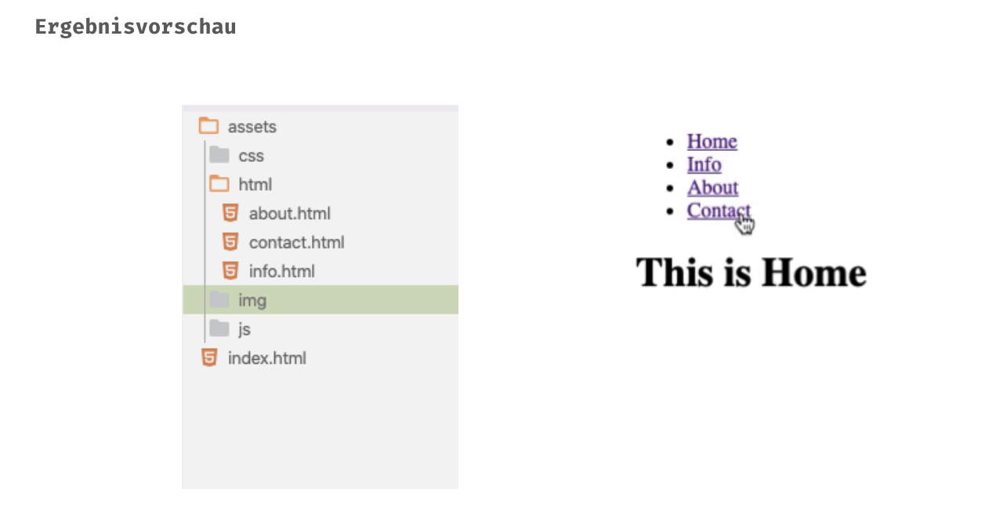

## HTML Einführung - Lev2_2_html-einführung_relative_path

Eine Übung im SuperCode Bootcamp

## 🎓 Aufgabe

Erstelle eine “Navigation”, mit der du zwischen mehreren html-Dateien navigieren kann.

## Hinweise

- Die index.html liegt in deinem Start-Verzeichnis.

- Die anderen html-Dateien liegen in assets/html/

- Jeder Navigationspunkt hat seine eigene html-Datei.

## 📸 Screenshots

## 💻 Running

Zur Seite —> - [Lev2_2_html-einführung_relative_path](https://mukkez.github.io/Bootcamp/tasks/Day_04/Lev2_2_html-einführung_relative_path/)

<h3 align="left">Languages and Tools:</h3>

 

