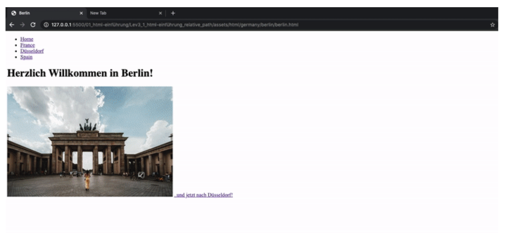

## HTML Einführung - Lev3_1_html-einführung_relative_path

Eine Übung im SuperCode Bootcamp

## 🎓 Aufgabe

So sollte deine Projekt-Struktur dieses Mal aussehen.
Hier haben wir eine Navigation auf allen Seiten und den Seiteninhalt mit einer h1, img und anchor-tag.
Nutze abwechselnd relative-Pfade aus dem Ordner “img” für den img-tag und aus dem Internet einen absolute path. Sucht eure eigenen Bilder hierzu aus ;-)
Such eure Bilder selbst aus bei `https://unsplash.com/` und speichere sie in eurem img-Ordner.

## Hinweise

- In deinem Startverzeichnis befinden sich ein Überordner “assets” und in diesem befinden sich zwei weitere Ordner (html, img).
- Die index.html liegt im Startverzeichnis.

- in dem Ordner “html” befinden sich weitere Ordner (france, germany, spain).
- in dem Ordner “france” befinden sich die Datei paris.html
- in dem Ordner “germany” befindet sich zwei Ordner (berlin, nrw)
- in dem Ordner “berlin” befindet sich die Datei berlin.html
- in dem Ordner “nrw” befindet sich die Datei düsseldorf.html
- in dem Ordner “spain” befindet sich die Datei spain.html

## 📸 Screenshots

## 💻 Running

Zur Seite —> - [Lev3_1_html-einführung_relative_path](https://mukkez.github.io/Bootcamp/tasks/Day_04/Lev3_1_html-einführung_relative_path/)

<h3 align="left">Languages and Tools:</h3>

 

