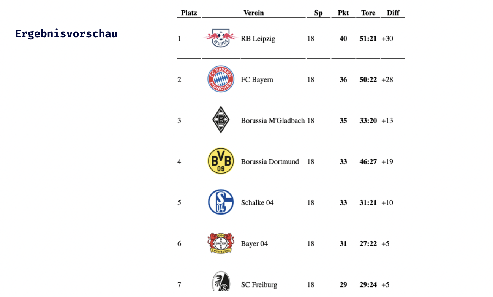

## HTML Einführung - Lev3_2_projekt_html-bundesligatabelle

Eine Übung im SuperCode Bootcamp

## 🎓 Aufgabe

Erstelle deine Traumtabelle der ersten Fußball Bundesliga.
Der CSS-Code befindet sich im Kommentarbereich!
Füg ihn zu deinem `<head>` hinzu.
Die Icons sind in einer Zip-Datei. Entpacke sie und füge sie in deinem Homepage-Ordner hinzu.

## 💡 Assets

```
<style>
   th,td {
      min-width: 50px;
      border-bottom: 1px solid black;
    }
</style>

```

## 📸 Screenshots



## 💻 Running

Zur Seite —> - [Lev3_2_projekt_html-bundesligatabelle](https://mukkez.github.io/Bootcamp/tasks/Day_04/Lev3_2_projekt_html-bundesligatabelle/)

<p align="left">
</p>

<h3 align="left">Languages and Tools:</h3>
<p align="left"> <a href="https://www.w3schools.com/html/" target="_blank" rel="noreferrer">  </a></p>
