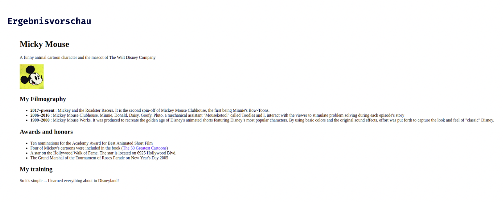

## HTML Einführung - Lev3_2_projekt_html-einführung_lebenslauf

Eine Übung im SuperCode Bootcamp

## 🎓 Aufgabe

Jetzt liegt es an dir! Für diese Übung musst du alle bisher erlangten HTML Kenntnisse zusammen einsetzen, um deinen Lebenslauf online zu stellen.
Die Webseite wird natürlich noch nicht den Designpreis des Jahres gewinnen, aber vielleicht später, nachdem du etwas über CSS gelernt hast!

## Ziel

Dein Lebenslauf sollte folgendes beinhalten:

- Dein Name als Überschrift `<h1>`.
- Ein kurzer Satz, der dich beschreibt, oder ein Zitat mit Autor (Quelle).
- Ein Miniaturfoto, das zum Vergrößern angeklickt werden kann.
- 3 Abschnitte, die je durch eine Überschriften `<h2>` getrennt sind.
  Z.B.: “Meine Ausbildung”, “Meine Fähigkeiten” und “Meine Erfahrungen”.

## 💡 Assets

```
- Die Ordnerstruktur sollte wie folgt aussehen:
    index.html
    assets
      img
        bild.png (jpg oder jpeg)
        bild-thumbnail.png (jpg oder jpeg)
- Um ein Miniaturfoto zu machen, kannst du diese Website benutzen: https://resizeimage.net/
- Das Miniaturfoto kann die Größe 150x150px haben


```

## 📸 Screenshots



## 💻 Running

Zur Seite —> - [Lev3_2_projekt_html-einführung_lebenslauf](https://mukkez.github.io/Bootcamp/tasks/Day_04/Lev3_2_projekt_html-einführung_lebenslauf/)

<p align="left">
</p>

<h3 align="left">Languages and Tools:</h3>
<p align="left"> <a href="https://www.w3schools.com/html/" target="_blank" rel="noreferrer">  </a></p>
