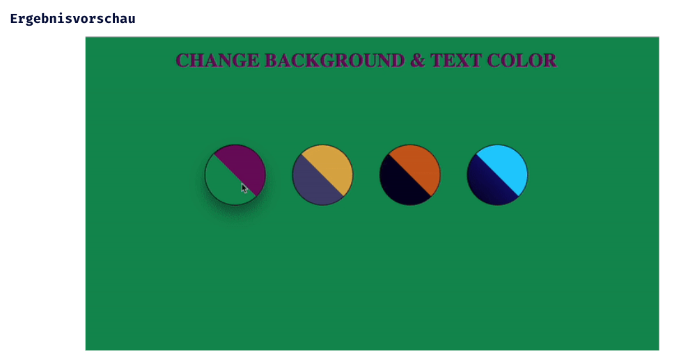

# JS Einführung - Lev3_1_js-einführung_function-onclick

Eine Übung im SuperCode Bootcamp

## 🎓 Aufgabe

Wir werden ein Anmeldeformular mit CSS erstellen. Das Formular besteht aus:

- Erstelle 4 SuperBalls, um die Hintergrundfarbe und Farbe zu ändern.
- Nutzt CSS um die Elemente zu stylen (Tipp: linear-gradient).
- Nun schreibe in JS jeweils eine eigene Funktion für die Elemente.
- Wenn der Benutzer auf die SuperBalls klickt, wird die “background-color” vom body und die “Color” von H1 geändert.
- Nachdem du diese Schritte befolgt hast, teste mit Klick dein Ergebnis. Viel Spaß!

#### Ein Design wird vorgeschlagen, aber dein Design kann anders aussehen.

## 📸 Screenshots

## 💻 Running

- [Lev3_1_js-einführung_function-onclick](https://mukkez.github.io/Bootcamp/tasks/Day_31/Lev3_1_js-einführung_function-onclick//)

<h3 align="left">Languages and Tools:</h3>

 
 
 

