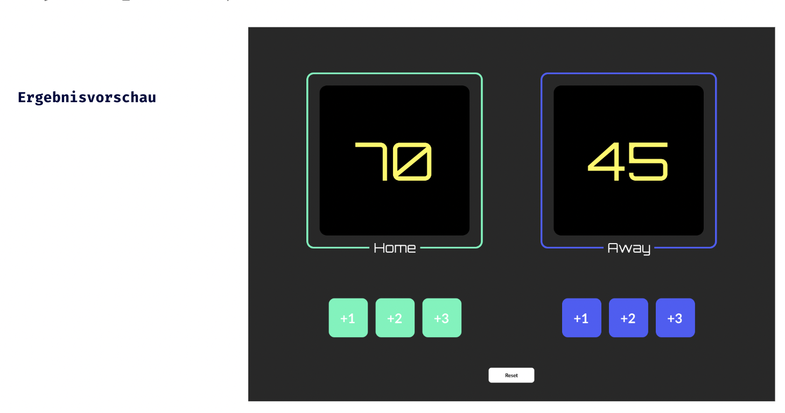

# Einführung JavaScript - Lev1_4_projekt_js-einführung_scorekeeper

Eine Übung im SuperCode Bootcamp

## 🎓 Aufgabe

Heute erstellen wir eine Seite, die den aktuellen Stand eines Basketballspiels zeigt.

- Die Seite lädt bei einem Anfangsspielstand von 0 - 0
- Wir haben sechs Buttons, die uns erlauben den Mannschaften (Home & Away) entweder 1, 2 oder 3 Punkte hinzuzufügen
- Es gibt noch einen Button (Reset) mit dem wir den Spielstand wieder auf 0 - 0 setzen können

#### Bonus

Erstelle einen Button, der ein modales Fenster öffnet, in dem der Benutzer die Teamnamen eingeben kann.

#### Themen

- Variablen deklarieren
- Funktionen definieren und aufrufen
- Textinhalte mit .innerText bzw. .innerHTML verändern

#### Assets

- Fonts: Orbitron, Lato
- Farben: #2C2C2C, #FDF860, #000000, #FFFFFF, #97F5BB, #525DF4

## 📸 Screenshots

## 💻 Running

- [Lev1_4_projekt_js-einführung_scorekeeper](https://mukkez.github.io/Bootcamp/tasks/Day_32/Lev1_4_projekt_js-einführung_scorekeeper/)

<h3 align="left">Languages and Tools:</h3>

 
 
 

