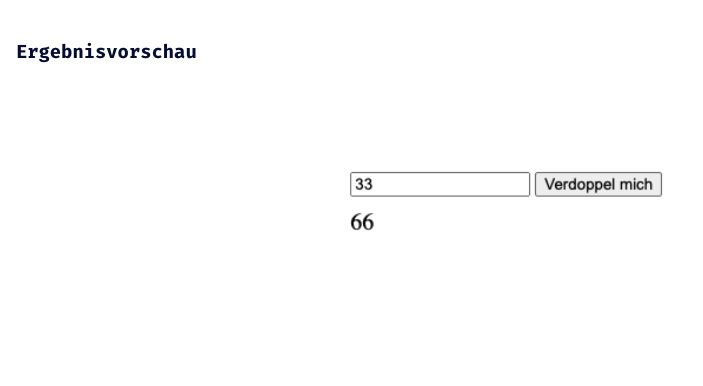

# JS Einführung - Lev1_1_forms+js_function-double

Eine Übung im SuperCode Bootcamp

## 🎓 Aufgabe

- Erstelle ein Formular, in dem du eine Zahl eingeben kannst.
- Erstelle einen Button, der eine Funktion aufruft.

- Deklariere eine Funktion, die den Wert aus deinem Input mit 2 multipliziert.
- Das Ergebnis soll in deinem HTML ausgegeben werden.

- Versuche es weiter, bis du es schaffst. Viel Erfolg!

## 📸 Screenshots

## 💻 Running

- [Lev1_1_forms+js_function-double](https://mukkez.github.ioBootcamp/tasks/Day_34/Forms/Lev1_1_forms+js_function-double/)

<h3 align="left">Languages and Tools:</h3>

 
 
 

