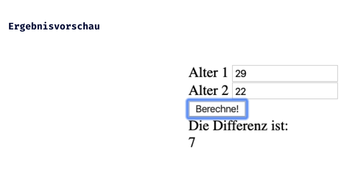

# JS Einführung - Lev1_3_forms+js_function-compare-age

Eine Übung im SuperCode Bootcamp

## 🎓 Aufgabe

- Erstelle eine Formular, um das Alter von zwei Leuten zu vergleichen.
- Nutze zwei Input Felder.
- Nutze einen Button, der eine Funktion aufruft.
- Definiere eine Funktion, die die Differenz in Jahren ausgibt.
- Gib die Differenz in deinem HTML aus.

#### Hinweise

- gib deiner form onsubmit="return false" falls sich deine Seite nach dem Absenden neu lädt

## 📸 Screenshots

## 💻 Running

- [Lev1_3_forms+js_function-compare-age](https://mukkez.github.io/Bootcamp/tasks/Day_34/Forms/Lev1_3_forms+js_function-compare-age/)

<h3 align="left">Languages and Tools:</h3>

 
 
 

