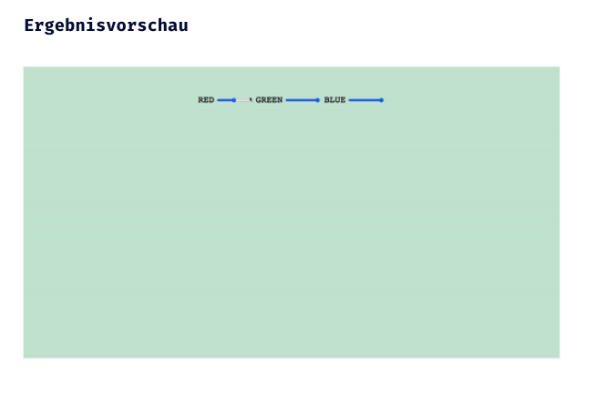

## CSS Vertiefung - Lev3_2_forms-js_change-background

Eine Übung im SuperCode Bootcamp

## 🎓 Aufgabe

- Erstelle ein Formular, um die Hintergrundfarbe vom <body> zu ändern.
- Nutze drei input Felder mit einer type=”range” und gebe ihnen jeweils ein label.
- Verwende in den input Feldern: id | name | min | max | value | step
- In allen input Feldern soll die Funktion changeBackground() mit onChange aufgerufen werden.
- Definiere in der Funktion changeBackground() neue value für rot, grün, blau.
- gib deiner form onsubmit="return false" falls sich deine Seite nach dem Absenden neu lädt
- Teste immer deine Ergebnisse mit einem console.log

## 📸 Screenshots

## 💻 Running

- [Lev3_2_forms-js_change-background](https://mukkez.github.io/Bootcamp/tasks/Day_34/Forms/Lev3_2_forms-js_change-background/)

<h3 align="left">Languages and Tools:</h3>

 
 
 

