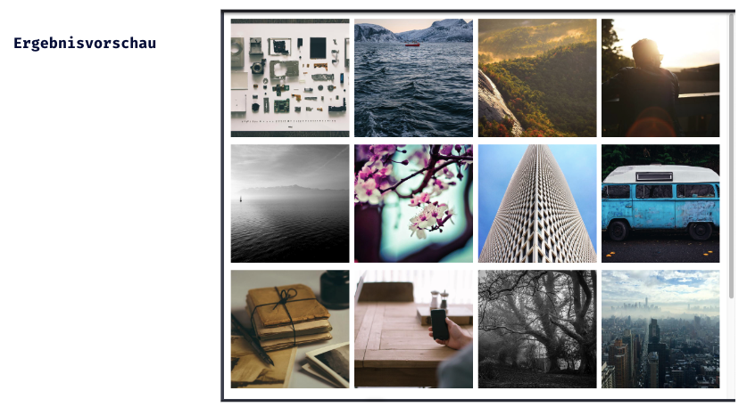

## CSS Vertiefung - Lev2_1_css-vertiefung_flexbox

Eine Übung im SuperCode Bootcamp

## 🎓 Aufgabe

Bei dieser Übung erstellen wir eine Bildergalerie.

Für zufällige Bilder der gleichen Größe kannst du z.B. diese Website verwenden:

https://picsum.photos/200/200

Die Zahlen am Ende definieren die Größe der Bilder. Die könnt ihr auch anpassen, aber wählt am besten einheitlich Bilder mit der gleichen Höhe, damit es da keine Probleme gibt.

## 📸 Screenshots

## 💻 Running

Zur Seite —> - [Lev2_1_css-vertiefung_flexbox](https://mukkez.github.io/Bootcamp/tasks/Day_35/Lev2_1_css-vertiefung_flexbox/)

<h3 align="left">Languages and Tools:</h3>

 
 
 

