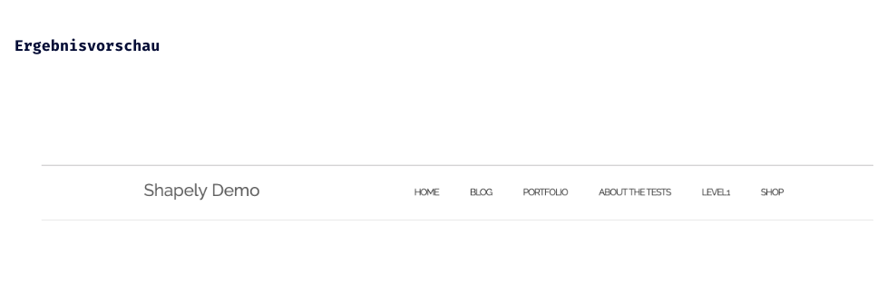

## CSS Vertiefung - Lev2_2_css-vertiefung_flex_navigation-shapely

Eine Übung im SuperCode Bootcamp

## 🎓 Aufgabe

Nachdem du ein paar Grundlagen von CSS gelernt hast, werden wir die Navigation gestalten. Im Moment werden wir auf die verschachtelten Listen verzichten.

## Hier sind die Assets für die Aufgabe:

- Font-family:"Raleway"
- Headerhöhe:76px
- Logofarbe: #666
- Logofarbe in hover: #333
- Menüfarbe: #333
- Menüfarbe in hover: #337ab7

## 📸 Screenshots

## 💻 Running

Zur Seite —> - [Lev2_2_css-vertiefung_flex_navigation-shapely](https://mukkez.github.io/Bootcamp/tasks/Day_35/Lev2_2_css-vertiefung_flex_navigation-shapely/)

<h3 align="left">Languages and Tools:</h3>

 
 
 

