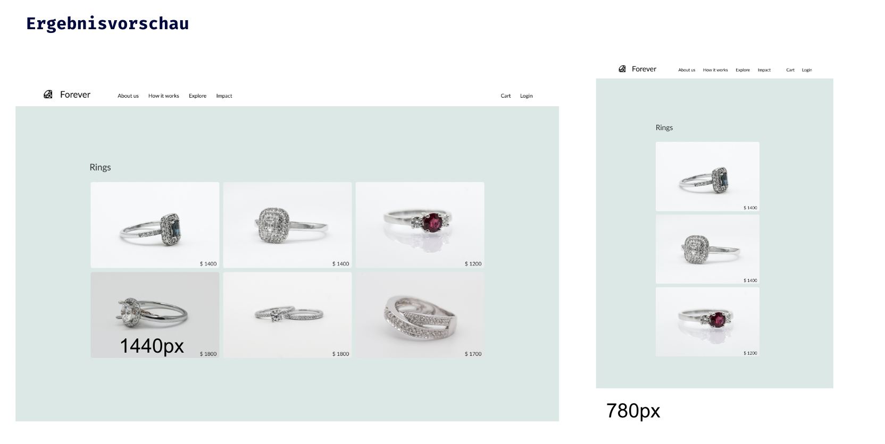

## CSS Vertiefung - Lev3_2_css-vertiefung_flexbox_forever

Eine Übung im SuperCode Bootcamp

## 🎓 Aufgabe

In dieser Aufgabe werden wir mit Hilfe von Flexbox eine Split Navigation und eine Bildergalerie erstellen.

- Die verwendete Schriftart: Lato
- Die background-color ist #D9E8E5, der graue Text ist rgba(0,0,0,.8)
- Nutze margin: auto um die letzten beiden Menüpunkte an den rechten Rand zu positionieren
- Nutze flex-wrap: wrap für die Bildergalerie.

## 📸 Screenshots

## 💻 Running

Zur Seite —> - [Lev3_2_css-vertiefung_flexbox_forever](https://mukkez.github.io/Bootcamp/tasks/Day_35/Lev3_2_css-vertiefung_flexbox_forever/)

<h3 align="left">Languages and Tools:</h3>

 
  

