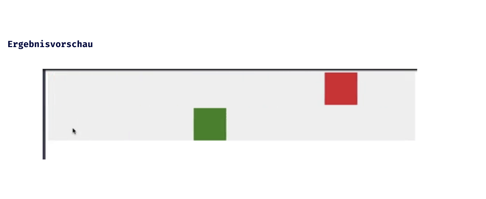

## CSS Vertiefung - Lev1_2_css-vertiefung_transition

Eine Übung im SuperCode Bootcamp

## 🎓 Aufgabe

- Für diese Animation brauchst du zwei Boxen die sich bei - Mouseover (:hover) von <section> bewegen.
- Sie sollen gleichzeitig ankommen, jedoch soll die untere Box 1 Sekunde nach der oberen starten.
- Section hat Position Relative, divs haben Position Absolute.
  Um Position zu ändern nutze beim :hover {left:90%};
  Setze die Startposition der div auf left: 0
- HTML Code befindet sich im Kommentar.
- Bitte schaue dir die Animation in der Ergebnisvorschau an.

## 📸 Screenshots

## 💻 Running

Zur Seite —> - [Lev1_2_css-vertiefung_transition](https://mukkez.github.io/Bootcamp/tasks/Day_36/Lev1_2_css-vertiefung_transition/)

<h3 align="left">Languages and Tools:</h3>

 
 
 

