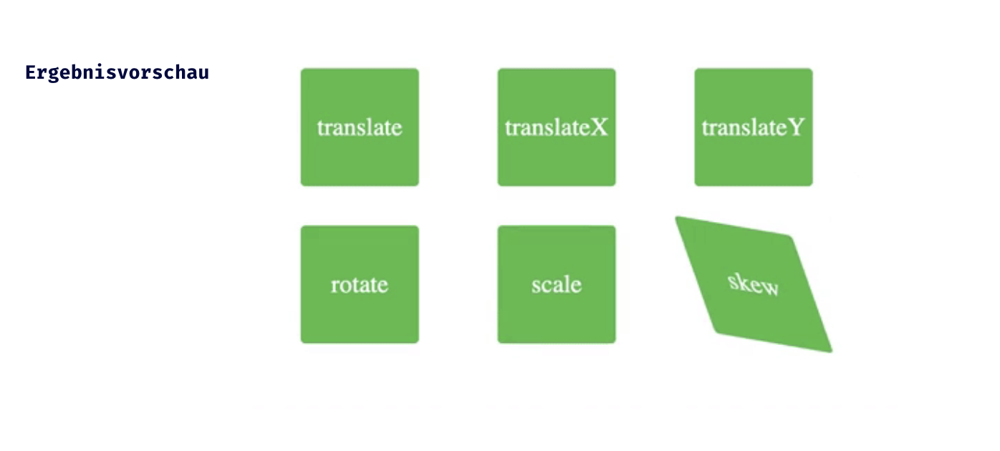

## CSS Vertiefung - Lev1_2_css-vertiefung_transform

Eine Übung im SuperCode Bootcamp

## 🎓 Aufgabe

Für diese Übung wirst Du mehrere Werte der CSS3-Eigenschaft “transform” verwenden.

Bitte schau Dir die Animation in der Ergebnisvorschau an.

## 📸 Screenshots

## 💻 Running

Zur Seite —> - [Lev1_2_css-vertiefung_transform](https://mukkez.github.io/Bootcamp/tasks/Day_37/Lev1_2_css-vertiefung_transform/)

<h3 align="left">Languages and Tools:</h3>

 
 
 

