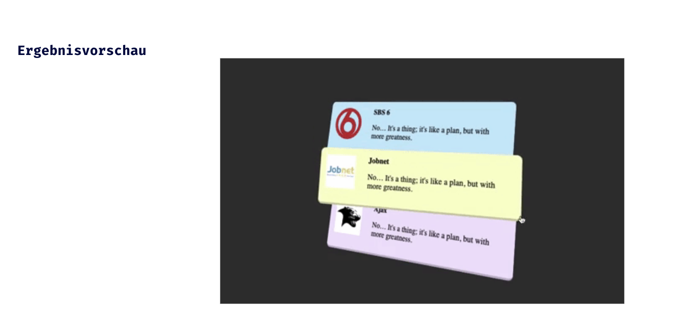

## CSS Vertiefung - Lev3_1_css-vertiefung_transform

Eine Übung im SuperCode Bootcamp

## 🎓 Aufgabe

Für diese Übung machen wir 3 Karten mit verschiedenen “z-index”.

Fahren wir mit der Maus über eine Karte, ändert diese ihren z-Index und dreht sich.

## 📸 Screenshots

## 💻 Running

Zur Seite —> - [Lev3_1_css-vertiefung_transform](https://mukkez.github.io/Bootcamp/tasks/Day_37/Lev3_1_css-vertiefung_transform/)

<h3 align="left">Languages and Tools:</h3>

 
 
 

