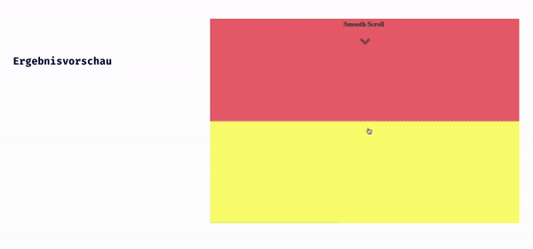

## CSS Vertiefung - Lev1_1_css-vertiefung_animation

Eine Übung im SuperCode Bootcamp

## 🎓 Aufgabe

Für diese Übung erstellen wir einen Pfeil der sich auf und ab bewegt. Wenn wir auf den Pfeil klicken, soll die Seite nach unten oder oben scrollen (smooth).

## 💡 Hinweise

- Die Funktion @keyframes sieht ungefähr so aus:

```
  @keyframes meine-animation {
    0%{
    ....
    }

    50% {
    ....
    }

    100% {
    ....
    }
  }
```

- Den Pfeil findest du z.b. bei “font-awesome” oder nutze HTML-Symbole.
- Jede `<section>` hat eine Höhe von “100vh”.
- Für “smoothscroll” suche nach “scroll-behavior”

## 📸 Screenshots



## 💻 Running

Zur Seite —> - [Lev1_1_css-vertiefung_animation](https://mukkez.github.io/Bootcamp/tasks/Day_38/Lev1_1_css-vertiefung_animation/)

<p align="left">
</p>

<h3 align="left">Languages and Tools:</h3>
<p align="left"> <a href="https://www.w3schools.com/html/" target="_blank" rel="noreferrer">  </a>
<a href="https://www.w3schools.com/css/" target="_blank" rel="noreferrer">  </a> </p>
