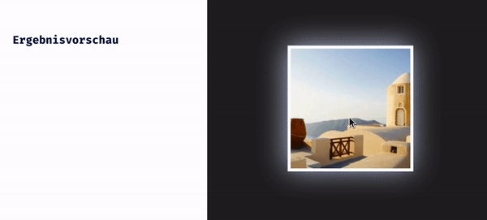

## CSS Vertiefung - Lev2_3_css-vertiefung_animation

Eine Übung im SuperCode Bootcamp

## 🎓 Aufgabe

Erstelle einen animierten Leuchteffekt mit CSS-Animationen und Box-Shadow;

Bitte schaue dir die Animation in der Ergebnisvorschau an.

## 💡 Hinweise

Benutze mehrere Box-Shadows, um den Effekt zu erzeugen.

## 📸 Screenshots

## 💻 Running

Zur Seite —> - [Lev2_3_css-vertiefung_animation](https://mukkez.github.io/Bootcamp/tasks/Day_38/Lev2_3_css-vertiefung_animation/)

<h3 align="left">Languages and Tools:</h3>

 

