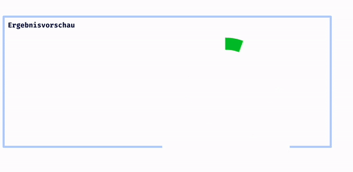

## CSS Vertiefung - Lev3_3_css-vertiefung_animation

Eine Übung im SuperCode Bootcamp

## 🎓 Aufgabe

Jetzt erstellst du eine Ladeanimation.

Bitte schaue dir die Animation in der Ergebnisvorschau an und nimm den Code aus dem Kommentarbereich.

## 💡 Hinweise

```Für die Animation musst du den Cicrle ansprechen.
Teste Werte bei stroke-dasharray ;-)

```

## 📸 Screenshots



## 💻 Running

Zur Seite —> - [Lev3_3_css-vertiefung_animation](https://mukkez.github.io/Bootcamp/tasks/Day_38/Lev3_3_css-vertiefung_animation/)

<p align="left">
</p>

<h3 align="left">Languages and Tools:</h3>
<p align="left"> <a href="https://www.w3schools.com/html/" target="_blank" rel="noreferrer">  </a>
<a href="https://www.w3schools.com/css/" target="_blank" rel="noreferrer">  </a></p>
