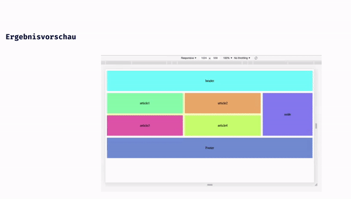

## CSS Vertiefung - Lev1_2_css-vertiefung_media-queries

Eine Übung im SuperCode Bootcamp

## 🎓 Aufgabe

Erstelle bitte dieses Muster nach, so wie du es unten siehst. Anschließend fügst du noch die media-queries hinzu. (siehe Ergebnisvorschau).

## 💡 Notes

```bash
// Medium devices (tablets, 768px and up)
@media (max-width: 768px) { ... }
// Small devices (landscape phones, 576px and up)
@media (max-width: 576px) { ... }
```

## 📸 Screenshots



## 💻 Running

Zur Seite —> - [Lev1_2_css-vertiefung_media-queries](https://mukkez.github.io/Bootcamp/tasks/Day_40/Lev1_2_css-vertiefung_media-queries/)

<p align="left">
</p>

<h3 align="left">Languages and Tools:</h3>
<p align="left"> <a href="https://www.w3schools.com/html/" target="_blank" rel="noreferrer">  </a>
<a href="https://www.w3schools.com/css/" target="_blank" rel="noreferrer">  </a> </p>
