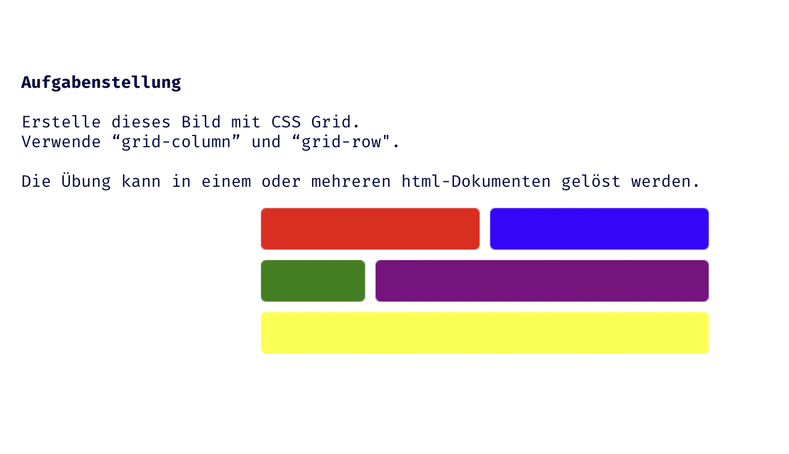
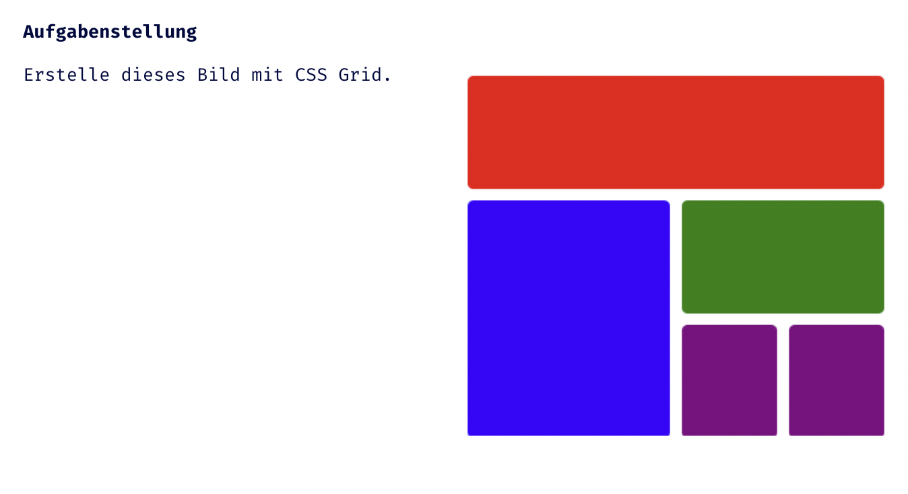

## CSS Vertiefung - Lev1_2_css-vertiefung_grid

Eine Übung im SuperCode Bootcamp

## 🎓 Aufgabe

Erstelle dieses Bild mit CSS Grid.
Verwende “grid-column” und “grid-row".

Die Übung kann in einem oder mehreren html-Dokumenten gelöst werden.

## 📸 Screenshots

## 💻 Running

Zur Seite —> - [Lev1_2_css-vertiefung_grid](https://mukkez.github.io/Bootcamp/tasks/Day_41/Lev1_2_css-vertiefung_grid/)

<h3 align="left">Languages and Tools:</h3>

 
  

