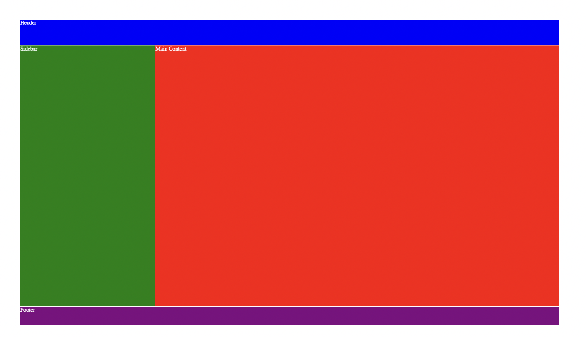

## CSS Vertiefung - Lev1_3_css-vertiefung_grid

Eine Übung im SuperCode Bootcamp

## 🎓 Aufgabe

In dieser Übung werden wir semantisches HTML wiederholen und zusätzlich Grid verwenden.

- Verwende folgende Tags: `<header>, <main>, <aside> und <footer>`.

- Verwende unter anderem die Befehle: grid-template-columns, grid-template-rows, grid-column, grid-row.

## 📸 Screenshots

## 💻 Running

Zur Seite —> - [Lev1_3_css-vertiefung_grid](https://mukkez.github.io/Bootcamp/tasks/Day_41/Lev1_3_css-vertiefung_grid/)

<h3 align="left">Languages and Tools:</h3>

 
  

