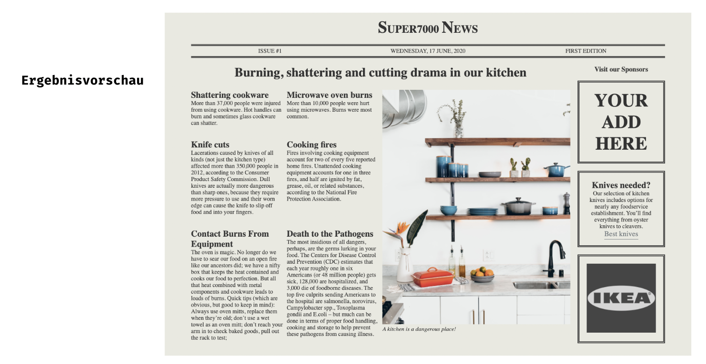

## CSS Vertiefung - Lev3_3_css-vertiefung_grid_newspaper

Eine Übung im SuperCode Bootcamp

## 🎓 Aufgabe

Heute wollen wir mit Grid eine kleine News-Seite bauen.

Überlegt euch gut, wo und wie (und welches) ihr Grid einsetzt!

## 💡 Assets

```
- Schrift: 'Cormorant Garamond'
- Farben: rgb(233, 233, 224), #333
```

## 📸 Screenshots



## 💻 Running

Zur Seite —> - [Lev3_3_css-vertiefung_grid_newspaper](https://mukkez.github.io/Bootcamp/tasks/Day_41/Lev3_3_css-vertiefung_grid_newspaper/)

<p align="left">
</p>

<h3 align="left">Languages and Tools:</h3>
<p align="left"> <a href="https://www.w3schools.com/html/" target="_blank" rel="noreferrer">  </a>
<a href="https://www.w3schools.com/css/" target="_blank" rel="noreferrer">  </a>  </p>
