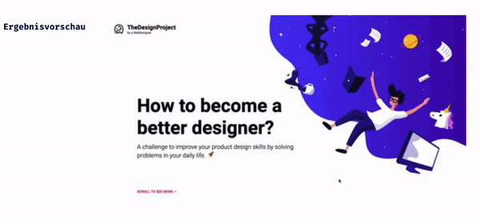

## CSS Vertiefung - Lev3_2_Project_css-vertiefung_designer-challenge

Eine Übung im SuperCode Bootcamp

## 🎓 Aufgabe

Hintergrund: Wie werde ich ein besserer Designer?

Diese Frage habe ich mir gestellt. Wie kann ich meine Design-Fähigkeiten verbessern und mehr Kund:innen anziehen? Ich wollte ein paar Konzepte entwerfen, die ich lange Zeit nur auf Papier hatte. Ich habe gesehen, dass viele Designer:innen (vor allem in Dribbble) eine tägliche Benutzeroberfläche erstellt haben. Die Idee hat mir gefallen, aber das Problem war, dass das Ergebnis nur etwas Schönes darstellte, aber kein Problem löste. So kam ich auf die Idee dieser täglichen Herausforderung.

Setze das Design für die Website responsiv um.

## 💡 Assets

```
- Font: Roboto
- Farben: #0b0c17 / #ff3571 / #dddddd / #3C30FF / #FFF / #000

```

### Bonus

Nun wollen wir dem/der User:in ein besseres UX/UI-Erlebnis mit JavaScript verschaffen!

Der/die User:in soll das erfolgreiche Eintragen der E-Mail-Adresse durch eine Bestätigungsseite “Confirmation Page” informiert werden.

- Verwende eine Funktion, die dem dem/der User:in nach der Einschreibung eine Bestätigungsnachricht anzeigt.
- Nutze zum Stylen auch JavaScript.
- Du kannst dir auch eigene Designs überlegen!
- Gib in der Konsole deine E-Mail-Adresse aus.

## Hinweis

Denke daran, deiner `<form>` den Zusatz onsubmit="return false" zu geben, damit die Seite nicht Browser die Seite nicht neu lädt.

## 📸 Screenshots



## 💻 Running

Zur Seite —> - [Lev3_2_Project_css-vertiefung_designer-challenge](https://mukkez.github.io/Bootcamp/tasks/Day_42/Lev3_2_Project_css-vertiefung_designer-challenge/)

<p align="left">
</p>

<h3 align="left">Languages and Tools:</h3>
<p align="left"> <a href="https://www.w3schools.com/html/" target="_blank" rel="noreferrer">  </a>
<a href="https://www.w3schools.com/css/" target="_blank" rel="noreferrer">  </a> 
<a href="https://www.w3schools.com/css/" target="_blank" rel="noreferrer">  </a> </p>
