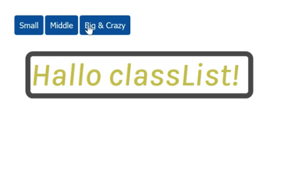

## JS Vertiefung - Lev2_10_js-vertiefung_DOM_add-classList_remove-classList_toggle_shadow

Eine Übung im SuperCode Bootcamp

## 🎓 Aufgabe

Schreibe drei Funktionen, die beim Anklicken des Buttons den Style ändern.

- Der HTML und CSS Code befindet sich im Kommentar.
- Nutze
- classList
- transition-property
- transition-duration
- text-shadow

## 📸 Screenshots

## 💻 Running

Zur Seite —> - [Lev2_10_js-vertiefung_DOM_add-classList_remove-classList_toggle_shadow](https://mukkez.github.io/Bootcamp/tasks/Day_46/Lev2_10_js-vertiefung_DOM_add-classList_remove-classList_toggle_shadow/)

<h3 align="left">Languages and Tools:</h3>

 
 
 

