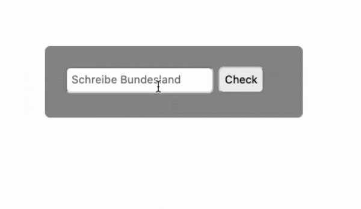

## JS Vertiefung - Lev2_5_js-vertiefung_conditional-statements_switch-break

Eine Übung im SuperCode Bootcamp

## 🎓 Aufgabe:

Schreibe eine Funktion, um Daten über die Bundesländer zu erhalten.

## 💡 Assets:

HTML und CSS befindet sich im Kommentar.
switch
case
break
default

```
.style {
  	margin: auto;
  	width: 220px;
  	padding: 20px;
  	background-color: #999;
  	font-family: Geneva, Tahoma, sans-serif;
  	border-radius: 5px;
	}

	button {
  	background: #333;
  	color: white;
  	border-radius: 5px;
  	padding: 5px;
	}

	input {
  	border-radius: 5px;
  	padding: 5px;
  	margin-bottom: 5px;
	}
  </style>

<div class="style">
	<input id="bundeslandInfo" type="text" placeholder="Schreibe Bundesland">
	<input type="button" value="Check" onclick="check()">
	<div id="bundeslandInfoErgebnis"></div>
  </div>
```

## 📝 Texte:

```
Baden-Württemberg hat 10,880 Mio Einwohner und Stuttgart ist die Hauptstadt
Bayern hat 12,844 Mio Einwohner und München ist die Hauptstadt
Berlin hat 3,520 Mio Einwohner und Berlin ist die Hauptstadt
Brandenburg hat 2,485 Mio Einwohner und Potsdam ist die Hauptstadt
Bremen hat 0,671 Mio Einwohner und Bremen ist die Hauptstadt
Hamburg hat 1,787 Mio Einwohner und Hamburg ist die Hauptstadt
Hessen hat 6,176 Mio Einwohner und Wiesbaden ist die Hauptstadt
Mecklenburg-Vorpommern hat 1,612 Mio Einwohner und Schwerin ist die Hauptstadt
Niedersachsen hat 7,927 Mio Einwohner und Hannover ist die Hauptstadt
Nordrhein-Westfalen hat 17,865 Mio Einwohner und Düsseldorf ist die Hauptstadt
Rheinland-Pfalz hat 4,053 Mio Einwohner und Mainz ist die Hauptstadt
Saarland hat 0,996 Mio Einwohner und Saarbrücken ist die Hauptstadt
Sachsen hat 4,085 Mio Einwohner und Dresden ist die Hauptstadt
Sachsen-Anhalt hat 2,245 Mio Einwohner und Magdeburg ist die Hauptstadt
Schleswig-Holstein hat 2,859 Mio Einwohner und Kiel ist die Hauptstadt
Thüringen hat 2,171 Mio Einwohner und Erfurt ist die Hauptstadt
Ein solches Bundesland gibt es in Deutschland nicht.
```

## 📸 Screenshots:



## 💻 Running

Zur Seite —> - [Lev2_5_js-vertiefung_conditional-statements_switch-break](https://mukkez.github.io/Bootcamp/tasks/Day_50/Lev2_5_js-vertiefung_conditional-statements_switch-break/)

<p align="left">
</p>

<h3 align="left">Languages and Tools:</h3>
<p align="left"> <a href="https://www.w3schools.com/html/" target="_blank" rel="noreferrer">  </a>
<a href="https://www.w3schools.com/css/" target="_blank" rel="noreferrer">  </a>
<a href="https://www.w3schools.com/css/" target="_blank" rel="noreferrer">  </a> </p>
````
