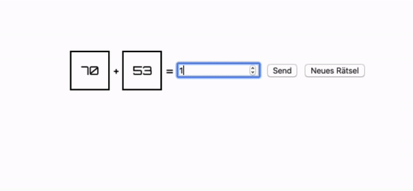

## Js Vertiefung - Lev3_5_projekt_js-einführung_addition-game

Eine Übung im SuperCode Bootcamp

## 🎓 Aufgabe

Erstelle ein kleines Spiel!

- Es werden zwei zufällige Zahlen zwischen 0 und 100 generiert.
- Der User muss diese Zahlen addieren und sein Ergebnis eingeben.
- Du musst ausgeben, ob der User richtig gerechnet hat ;-)

## 📸 Screenshots

## 💻 Running

Zur Seite —> - [Lev3_5_projekt_js-einführung_addition-game](https://mukkez.github.io/Bootcamp/tasks/Day_52/Lev3_5_projekt_js-einführung_addition-game/)

<h3 align="left">Languages and Tools:</h3>

 
 
 

