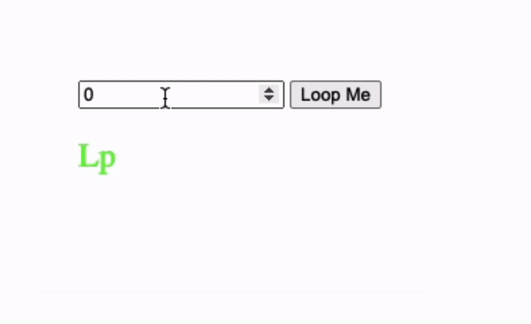

## Js Vertiefung - Lev2_2_js-vertiefung_loops_with_input

Eine Übung im SuperCode Bootcamp

## 🎓 Aufgabe

- Wir haben in unserem HTML ein Inputfeld, in dem der User eine Zahl eingeben soll.
- Schreibe eine Funktion, mit der du am Ende in deinem HTML das Wort “Loop” ausgibst.
- Die Anzahl der Buchstaben “o” variiert durch die Eingabe des Users.

## 💡 Hinweise

- Du wirst mit einem Array arbeiten müssen.
- Nutze einen Loop und eine Array-Methode, um an einer bestimmten Stelle das neue Element hinzuzufügen.
- Wandle das Array am Ende in einen String um.

## 📸 Screenshots

## 💻 Running

Zur Seite —> - [Lev2_2_js-vertiefung_loops_with_input](https://mukkez.github.io/Bootcamp/tasks/Day_58/Lev2_2_js-vertiefung_loops_with_input/)

<h3 align="left">Languages and Tools:</h3>

 
 
 

