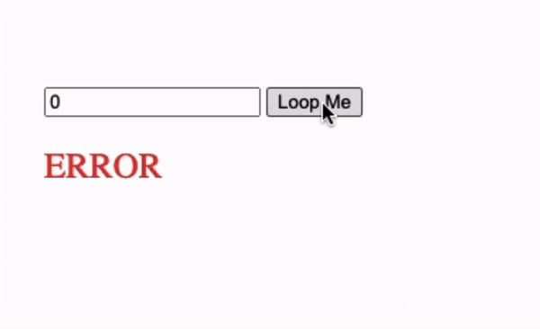

## Js Vertiefung - Lev3_3_js-vertiefung_complicated_loops_with_input

Eine Übung im SuperCode Bootcamp

## 🎓 Aufgabe

- Wir verfeinern unseren “Loooooop” aus Aufgabe 2_2
- Jetzt wollen wir eine Fehlermeldung ausgeben, wenn der User 0 eingibt
- Zusätzlich überprüfen wir, ob der User eine gerade Zahl eingegeben hat
  - wenn das der Fall ist werden wir nur die Buchstaben“o” in unsere Ausgabe schreiben
  - Bsp: // input: 4 output: Loooop
- wenn die Zahl ungerade ist
  - möchten wir, dass sich die Buchstaben “o” und die Zahlen “0” in der Ausgabe abwechseln
  - Bsp: // input: 5 output: Lo0o0op

## 📸 Screenshots

## 💻 Running

Zur Seite —> - [Lev3_3_js-vertiefung_complicated_loops_with_input](https://mukkez.github.io/Bootcamp/tasks/Day_58/Lev3_3_js-vertiefung_complicated_loops_with_input/)

<h3 align="left">Languages and Tools:</h3>

 
 
 

