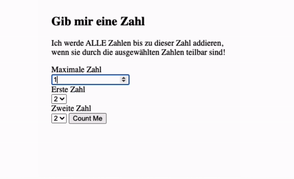

## Js Vertiefung - Lev3_4_js-vertiefung_loops_sum_of_numbers-RETHINK

Eine Übung im SuperCode Bootcamp

## 🎓 Aufgabe

- Wir wollen mit Hilfe eines Loops etwas berechnen.
- Wir haben einen input, in dem der User eine Nummer eingeben soll.
- Wir haben 2 Select-Optionen, bei denen der User eine Zahl zwischen 2 und 9 auswählen kann.
- Wir wollen jede Zahl von 0 bis zu der Zahl, die der User in das Input-Feld eingegeben hat, überprüfen.
- Wenn diese Zahl durch eine der ausgewählten Zahlen teilbar ist, soll sie zur Gesamtsumme addiert werden

  ```
   Bsp: input: 10, select1: 3, select2: 5
   3+5+6+9 = 23
   Bsp: input: 10, select1: 4, select2: 7
   4+7+8 = 19
  ```

## 💡 Hinweise

- Nutze einen Loop
- Nutze den Modulo, um zu überprüfen, ob die Zahl durch die ausgewählten teilbar ist.

## 🍬 Bonus

- Gib eine Fehlermeldung, wenn der User eine leere Eingabe geschrieben hat.
- Gib eine Fehlermeldung, wenn der User in beiden select dieselbe Zahl gewählt hat.

## 📸 Screenshots



## 💻 Running

Zur Seite —> - [Lev3_4_js-vertiefung_loops_sum_of_numbers-RETHINK](https://mukkez.github.io/Bootcamp/tasks/Day_58/Lev3_4_js-vertiefung_loops_sum_of_numbers-RETHINK/)

<p align="left">
</p>

<h3 align="left">Languages and Tools:</h3>
<p align="left"> <a href="https://www.w3schools.com/html/" target="_blank" rel="noreferrer">  </a>
<a href="https://www.w3schools.com/css/" target="_blank" rel="noreferrer">  </a> 
<a href="https://www.w3schools.com/css/" target="_blank" rel="noreferrer">  </a> </p>
