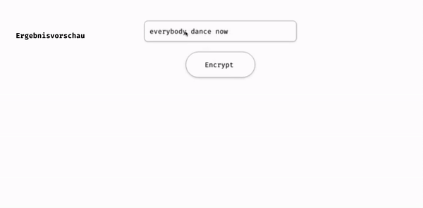

## Js Vertiefung - Lev3_5_projekt_js-vertiefung_Mors-encrypter

Eine Übung im SuperCode Bootcamp

## Geschichte

Eine alte Dame ist letztens in den Wald gegangen, um Pilze zu suchen und verirrte sich dort. Aus dem Wald half ihr ein alter Mann, der in den Bergen lebt. Sie scheinen sich auf den ersten Blick verliebt zu haben und wollen in Kontakt bleiben.
Das Problem ist, dass der ältere Herr kein Telefon und kein Internet hat.
Sie können nur mit Hilfe von Morsecode kommunizieren.
Hilf der alten Dame eine Verbindung mit dem “Berg-Opa” herzustellen.
❤✉

## 🎓 Aufgabenstellung

Es muss eine Funktion entwickelt werden, mit der man einfachen Text in Morsecode übersetzen kann. Das Array ist im Kommentar angegeben.

```
let morseAlphabet = [
  { letter: "1", morseCode: ".----" },
  { letter: "2", morseCode: "..---" },
  { letter: "3", morseCode: "...--" },
  { letter: "4", morseCode: "....-" },
  { letter: "5", morseCode: "....." },
  { letter: "6", morseCode: "-...." },
  { letter: "7", morseCode: "--..." },
  { letter: "8", morseCode: "---.." },
  { letter: "9", morseCode: "----." },
  { letter: "0", morseCode: "-----" },
  { letter: " ", morseCode: "    " },
  { letter: "A", morseCode: ".-" },
  { letter: "B", morseCode: "-..." },
  { letter: "C", morseCode: "-.-." },
  { letter: "D", morseCode: "-.." },
  { letter: "E", morseCode: "." },
  { letter: "F", morseCode: "..-." },
  { letter: "G", morseCode: "--." },
  { letter: "H", morseCode: "...." },
  { letter: "I", morseCode: ".." },
  { letter: "J", morseCode: ".---" },
  { letter: "K", morseCode: "-.-" },
  { letter: "L", morseCode: ".-.." },
  { letter: "M", morseCode: "--" },
  { letter: "N", morseCode: "-." },
  { letter: "O", morseCode: "---" },
  { letter: "P", morseCode: ".--." },
  { letter: "Q", morseCode: "--.-" },
  { letter: "R", morseCode: ".-." },
  { letter: "S", morseCode: "..." },
  { letter: "T", morseCode: "-" },
  { letter: "U", morseCode: "..-" },
  { letter: "V", morseCode: "...-" },
  { letter: "W", morseCode: ".--" },
  { letter: "X", morseCode: "-..-" },
  { letter: "Y", morseCode: "-.--" },
  { letter: "Z", morseCode: "--.." }
];
```

## 📸 Screenshots



## 💻 Running

Zur Seite —> - [Lev3_5_projekt_js-vertiefung_Mors-encrypter](https://mukkez.github.io/Bootcamp/tasks/Day_62/Lev3_5_projekt_js-vertiefung_Mors-encrypter/)

<p align="left">
</p>

<h3 align="left">Languages and Tools:</h3>
<p align="left"> <a href="https://www.w3schools.com/html/" target="_blank" rel="noreferrer">  </a>
<a href="https://www.w3schools.com/css/" target="_blank" rel="noreferrer">  </a> 
<a href="https://www.w3schools.com/css/" target="_blank" rel="noreferrer">  </a> </p>
