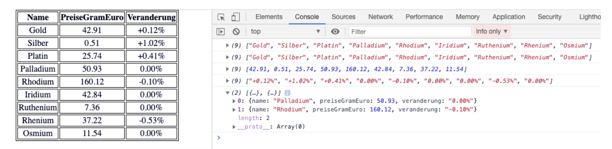

## Js Vertiefung - Lev2_1_js-vertiefung_objects_loop

Eine Übung im SuperCode Bootcamp

## 🎓 Aufgabe

Greife auf die Objekte im Array mit Hilfe von map(), forEach(), filter() zu.
Der Code dazu ist im Kommentarbereich.

- Verwende forEach() und greife auf alle name zu. Pushe diese in ein neues Array.
- Verwende map() und greife auf alle name zu.
- Verwende forEach() und greife auf alle preiseGramEuro zu und pushe diese ein neues Array.
- Verwende map() und greife auf alle preiseGramEuro zu.
- Verwende forEach() und greife auf alle veraenderung zu und pushe in ein neues Array.
- Verwende map() und greife auf alle veraenderung zu.
- Verwende filter() und greife auf preiseGramEuro die teurer als 50 Euro zu
- Gib alles als Tabelle in deinem HTML-Dokument aus.

## 📸 Screenshots

## 💻 Running

Zur Seite —> - [Lev2_1_js-vertiefung_objects_loop](https://mukkez.github.io/Bootcamp/tasks/Day_63/Lev2_1_js-vertiefung_objects_loop/)

<h3 align="left">Languages and Tools:</h3>

 
 
 

