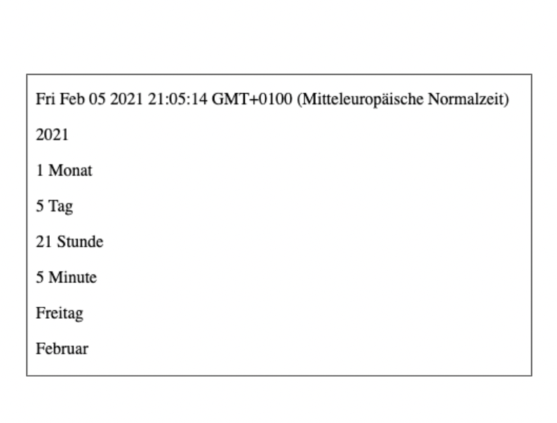
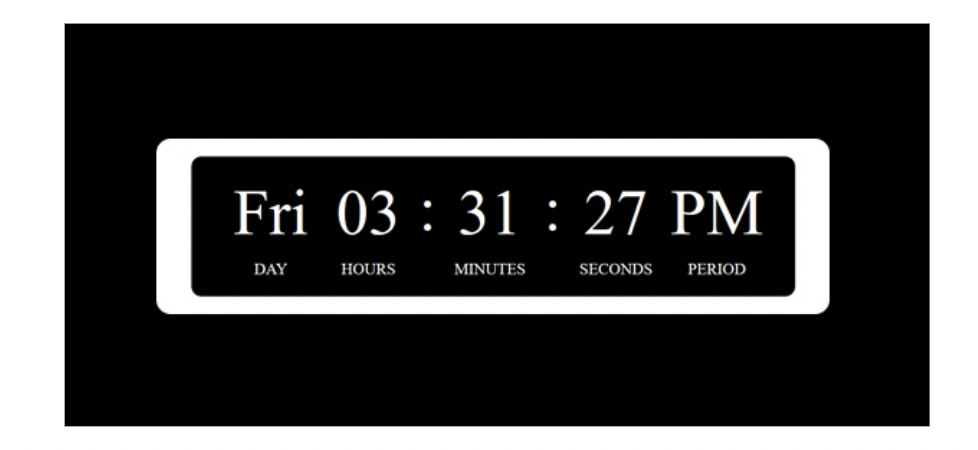

## Js Vertiefung - Lev1_2_js-vertiefung_date_get-date-methods

Eine Übung im SuperCode Bootcamp

## 🎓 Aufgabe

In dieser Übung lernen wir die Date Methods

- Zeige die Daten wie auf dem Screenshot an.
- Verwende den Code aus dem Kommentarbereich, um den Wochentag und Monat anzuzeigen.
  - Nutze Google, wenn du nicht weiterkommst
  - Hinweis: du siehst hier das aktuelle Datum des Screenshots! Dein Ergebnis orientiert sich an dem aktuellen Datum.

## 📸 Screenshots

 
 
 
 

## 🎓 Aufgabe

- Erstelle ein schönes CSS-Design für Deine elektronische Uhr und füge ein festes Datum ein. Dieses Design werden wir später verwenden um eine funktionierende Uhr zu bauen!
  - Beispiel:

## 💻 Running

Zur Seite —> - [Lev1_2_js-vertiefung_date_get-date-methods](https://mukkez.github.io/Bootcamp/tasks/Day_64/Lev1_2_js-vertiefung_date_get-date-methods/)

<h3 align="left">Languages and Tools:</h3>

 
 
 

