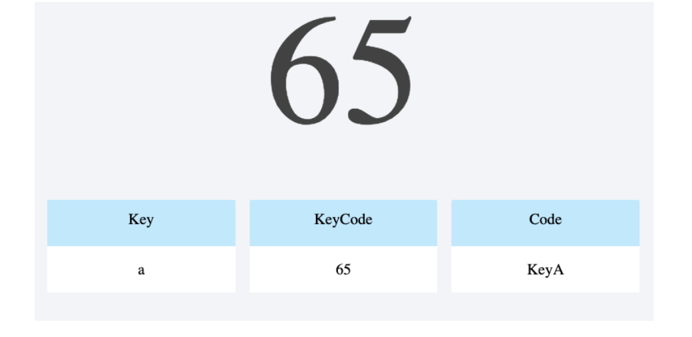

## Js Vertiefung - Lev2_2_js-vertiefung_events_key-code-info

Eine Übung im SuperCode Bootcamp

## 🎓 Aufgabe

Schreibe eine kleine App, die Dir die Taste ("key"), den Unicode Tastencode ("keyCode") und den "Code" anzeigt, sobald Du eine Taste auf deinem Keyboard drückst.

## 📸 Screenshots

## 💻 Running

Zur Seite —> - [Lev2_2_js-vertiefung_events_key-code-info](https://mukkez.github.io/Bootcamp/tasks/Day_65/Lev2_2_js-vertiefung_events_key-code-info/)

<h3 align="left">Languages and Tools:</h3>

 
 
 

