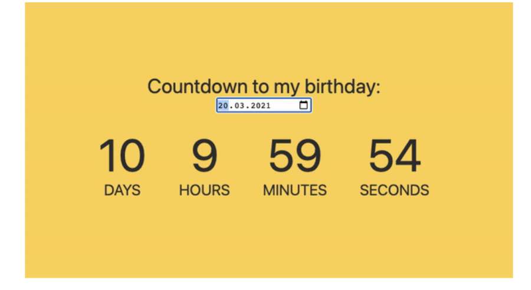

## Js Vertiefung - Lev2_4_js-vertiefung_events_counter_birthday

Eine Übung im SuperCode Bootcamp

## 🎓 Aufgabe

Schreibe eine kleine App, die die Zeit bis zu deinem Geburtstag zählt.
Zeit = Tage, Stunden, Minuten, Sekunden.

- Nutze:
  - setInterval
  - Math.floor
  - new Date()
  - getTime()
  - getElementById

## 📸 Screenshots

## 💻 Running

Zur Seite —> - [Lev2_4_js-vertiefung_events_counter_birthday](https://mukkez.github.io/Bootcamp/tasks/Day_65/Lev2_4_js-vertiefung_events_counter_birthday/)

<h3 align="left">Languages and Tools:</h3>

 
 
 

