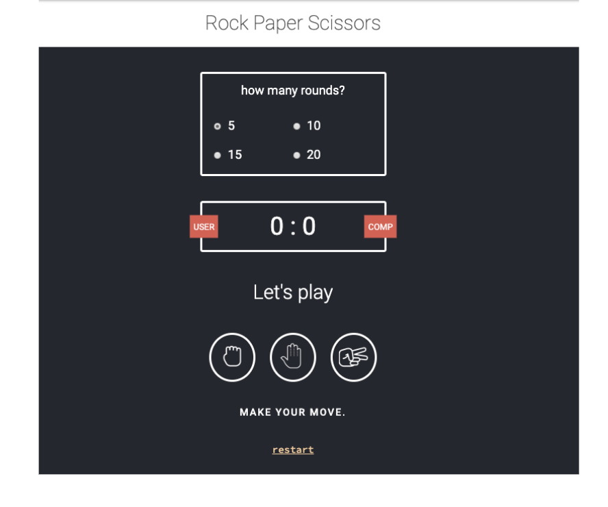

## Js Vertiefung - Lev3_9_projekt_js-vertiefung_rock-paper-scissors

Eine Übung im SuperCode Bootcamp

## 🎓 Aufgabe

Jeder hat in seinem Leben schon einmal "Rock, Paper, Scissors" (Schnick, Schnack, Schnuck) gespielt. Ihr kennt die Regeln also bereits. ;)

Definiere, wie viele Runden ein Unser gegen den Computer spielen wird.
Die Farbe sollte sich ändern, wenn es sich um einen Gewinn, ein Unentschieden oder eine Niederlage handelt.

Das Design im Anhang ist nur ein Vorschlag, ihr könnt hier gerne kreativ werden. ;)

## Co-authored-by: Sofia <SofiaVossen@users.noreply.github.com>

## Co-authored-by: NicoleBorbe <NicoleBorbe@users.noreply.github.com>

## 📸 Screenshots

## 💻 Running

Zur Seite —> - [Lev3_9_projekt_js-vertiefung_rock-paper-scissors](https://mukkez.github.io/Bootcamp/tasks/Day_66-68/Lev3_9_projekt_js-vertiefung_rock-paper-scissors/)

<h3 align="left">Languages and Tools:</h3>

 
 
 

