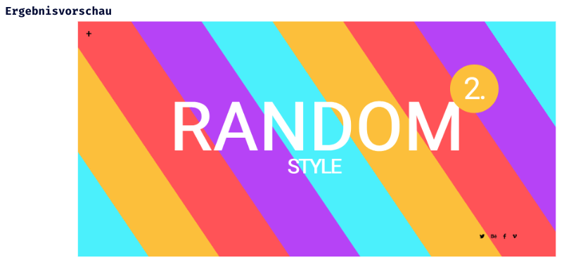

## CSS Extension - Lev2_1_css-extension_sass_variables_nesting

Eine Übung im SuperCode Bootcamp

## 🎓 Aufgabe

In dieser Übung werden wir "Variables" und "Nesting" verwenden. Erinnere dich an "linear-gradient".
Farbvariablen - Das Einstellen von Farbvariablen macht es einfacher, Farben beim Prototyping und beim Erstellen deiner Website wiederzuverwenden, ohne sich an jeden einzelnen Hex-Farbcode oder HTML-Farbnamen erinnern zu müssen.

- Schreibe den Code so, dass das Ergebnis wie auf der letzten Folie aussieht.
- Verwende den Generator, um einen Hintergrund zu erstellen.
- Schreibe Farben und linear-gradient als Variable an den Anfang in style.scss.
- Benutze Nesting.

## 📸 Screenshots

## 💻 Running

Zur Seite —> - [Lev2_1_css-extension_sass_variables_nesting](https://mukkez.github.io/Bootcamp/tasks/Day_69/Lev2_1_css-extension_sass_variables_nesting/)

<h3 align="left">Languages and Tools:</h3>

 
 
 
 

