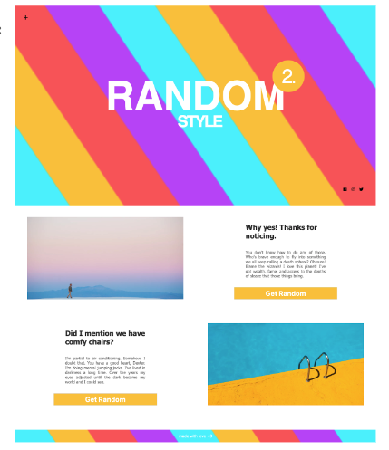

## CSS Extension:SASS - Projekt_Lev3_1_css-extension_sass_random

Eine Übung im SuperCode Bootcamp

## 🎓 Aufgabe

Für dieses Projekt werden wir die Hauptfunktionen von Sass verwenden.
Unser Projekt wird aus 4 Abschnitten bestehen:

- Home
- About
- Services
- Footer

**Der Home-Bereich besteht aus:**

- Ein Hintergrund (linear-gradient) mit mehreren Farben
- Socialmedia
- Content (h1+h2)

**Der About-Bereich besteht aus:**

- Bild
- Content (h1+p+button)

**Der Services-Bereich besteht aus:**

- Content (h1+p+button)
- Bild

**Der Footer-Bereich besteht aus:**

- Ein Hintergrund (linear-gradient) mit mehreren Farben
- Content (p)

## 💡 Hinweise

Das Projekt muss aus mehreren Dateien bestehen:

- index.html
- assets
  - scss
    - \_variables.scss
    - \_mixins.scss
    - style.scss
  - img

Gradient Stripes Generator http://stripesgenerator.com/

## 📸 Screenshots

## 💻 Running

Zur Seite —> - [Projekt_Lev3_1_css-extension_sass_random](https://mukkez.github.io/Bootcamp/tasks/Day_69/Projekt_Lev3_1_css-extension_sass_random/)

<h3 align="left">Languages and Tools:</h3>

 
 
 
 

