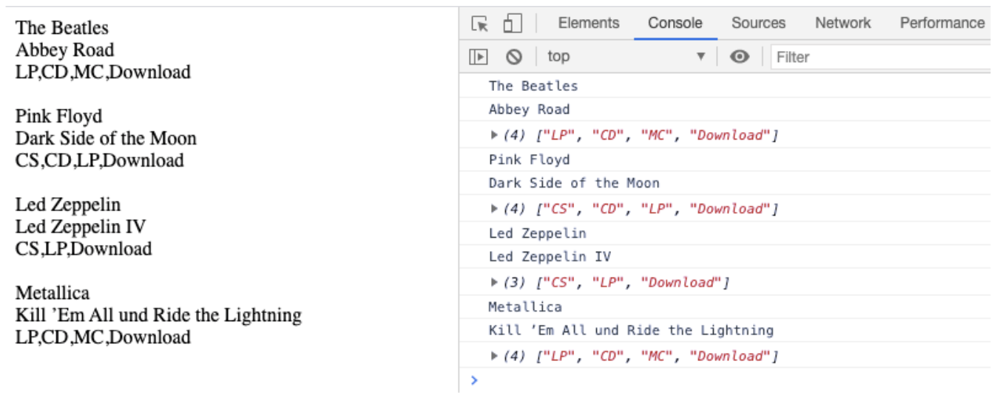

## Js Vertiefung - Lev1_7_js-vertiefung_objects_arrays_loop_accessing

Eine Übung im SuperCode Bootcamp

## 🎓 Aufgabe

In dieser Übung lernen wir, wie man auf die Objekte mit Hilfe von forEach() zugreift.

- Verwende den Code aus dem Kommentarbereich.
- Greife auf die Eigenschaften des Objekts zu und gib folgende Werte mit forEach()
  im HTML aus:
  - Alle “artist”
  - Alle “title”
  - Alle “medium”

Bonus Aufgabe:

- Gib alle “release_year” älter als 1975 aus

## 📸 Screenshots

## 💻 Running

Zur Seite —> - [Lev1_7_js-vertiefung_objects_arrays_loop_accessing](https://mukkez.github.io/Bootcamp/tasks/Day_70/Lev1_7_js-vertiefung_objects_arrays_loop_accessing/)

<h3 align="left">Languages and Tools:</h3>

 
 
 

