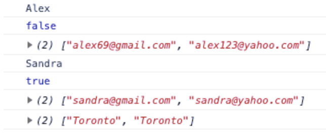

## Js Vertiefung - Lev1_8_js-vertiefung_objects_arrays_loop_accessing

Eine Übung im SuperCode Bootcamp

## 🎓 Aufgabe

- Verwende den Code aus dem Kommentarbereich.
- Greife mithilfe von forEach() oder map() auf Eigenschaften dieses Objekts zu.
- Schreibe Funktion für das Objekt, die in der Console folgendes ausgeben:
  - name
  - coop
  - city
  - emails

## 📸 Screenshots

## 💻 Running

Zur Seite —> - [Lev1_8_js-vertiefung_objects_arrays_loop_accessing](https://mukkez.github.io/Bootcamp/tasks/Day_70/Lev1_8_js-vertiefung_objects_arrays_loop_accessing/)

<h3 align="left">Languages and Tools:</h3>

 
 
 

