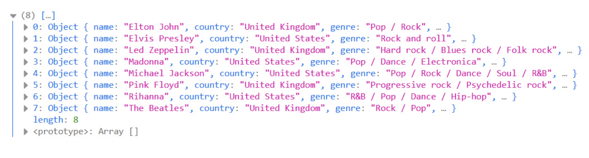

## Js Vertiefung - Lev2_2_js-vertiefung_array-objects_sort_singers

Eine Übung im SuperCode Bootcamp

## 🎓 Aufgabe

Du hast Sammlungen deiner Lieblingsbands. Du möchtest sie alphabetisch sortieren.
Sortiere die Bands alphabetisch nach Namen.

- Verwende den Code aus dem Kommentarbereich.
- Sortiere die Bands alphabetisch.
- Gib es in der Konsole aus.

Assets

- sort()
- if else
- return

## 📸 Screenshots

## 💻 Running

Zur Seite —> - [Lev2_2_js-vertiefung_array-objects_sort_singers](https://mukkez.github.io/Bootcamp/tasks/Day_70/Lev2_2_js-vertiefung_array-objects_sort_singers/)

<h3 align="left">Languages and Tools:</h3>

 
 
 

