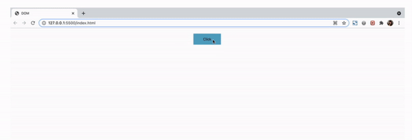

## Js Vertiefung - Lev2_7_js-vertiefung_DOM_querySelector_createTextNode_appendChild_nummern

Eine Übung im SuperCode Bootcamp

## 🎓 Aufgabe

- Schreibe eine Funktion, die beim Anklicken des Buttons ein Element mit aufsteigenden Nummern erstellt.
- Der HTML und CSS Code befindet sich im Kommentar.
  - Nutze
  - querySelector()
  - addEventListener()
  - let counter = 0;
  - createElement()
  - textContent()
  - appendChild()
  - classList

## 📸 Screenshots

## 💻 Running

Zur Seite —> - [Lev2_7_js-vertiefung_DOM_querySelector_createTextNode_appendChild_nummern](https://mukkez.github.io/Bootcamp/tasks/Day_72/Lev2_7_js-vertiefung_DOM_querySelector_createTextNode_appendChild_nummern/)

<h3 align="left">Languages and Tools:</h3>

 
 
 
 

