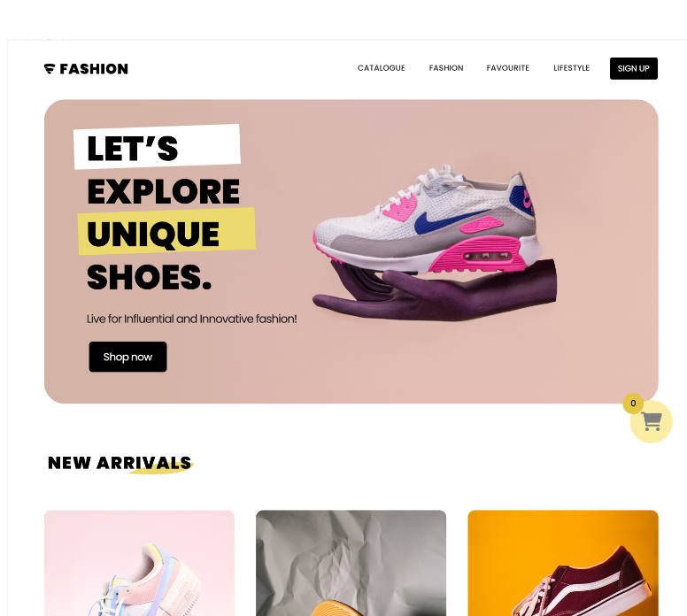

## Js Vertiefung - Lev3_21_js-vertiefung_schuh_shop

Eine Übung im SuperCode Bootcamp

## 🎓 Aufgabe

Heute erstellst du einen Schuh-Online-Shop.
Das Figma-Layout findest du hier und den Prototypen kannst du dir hier angucken.

Die Inhalte der Seite werden statisch über das HTML eingefügt. Nur die Liste mit den angebotenen Schuhen (unter der Überschrift “New arrivals”), fügst du über das JavaScript ein. Dafür findest du unten in den Kommentaren ein Array, was verarbeitet werden soll.

## 📸 Screenshots

## 💻 Running

Zur Seite —> - [Lev3_21_js-vertiefung_schuh_shop](https://mukkez.github.io/Bootcamp/tasks/Day_74-Day_78/Lev3_21_js-vertiefung_schuh_shop/)

<h3 align="left">Languages and Tools:</h3>

 
 
 
 

