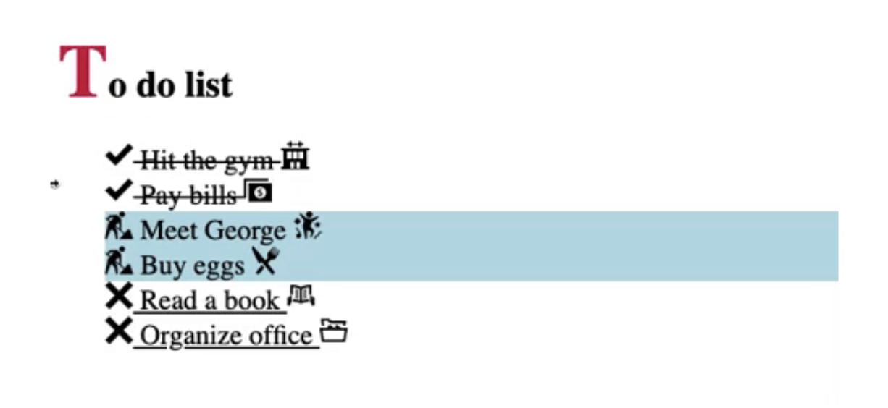
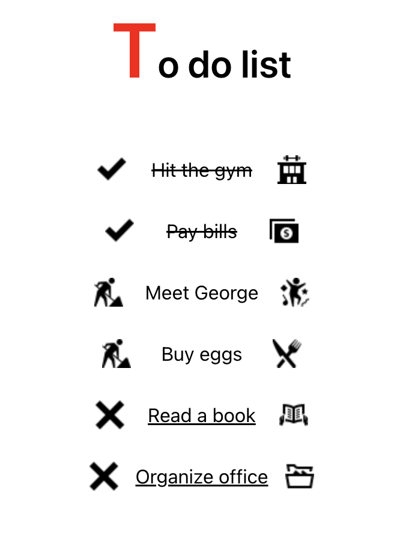

## React – sfc, props, map - Lev1_3_react-props

Eine Übung im SuperCode Bootcamp

## 🎓 Aufgabe

Ihr erinnert euch vielleicht noch an die Übung mit der To-Do-Liste.
Dieses Mal wollen wir sie in React nachbauen.
Erstelle dir eine “Datenbank” (data mit Array und Objekten)
Nutze props um den Text und die Bilder einzufügen!
Google wie du Bilder in React lokal einbinden kannst!

## 📸 Screenshots Aufgabe

## 📸 Screenshots Lösung

<h3 align="left">Languages and Tools:</h3>

 
 
 

