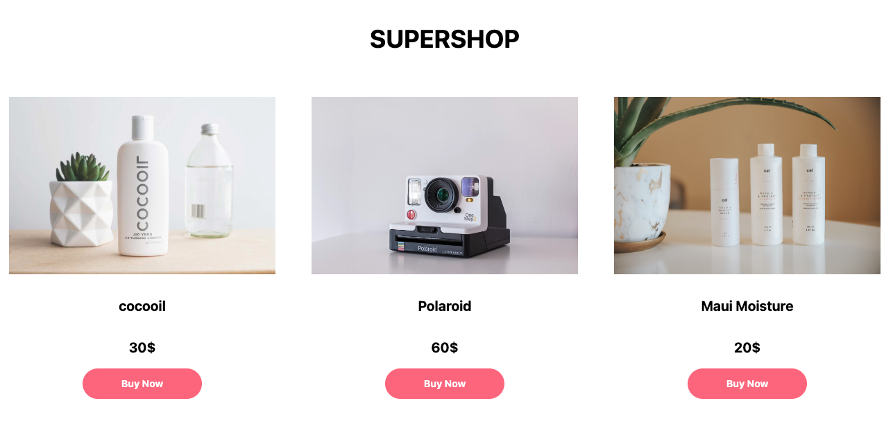

## React – sfc, props, map - lev2_1_js-reactjs_props_products

Eine Übung im SuperCode Bootcamp

## 🎓 Aufgabe

Erstelle eine Produktkomponente, die die Produktkarten ausgibt.
Dabei werden Preis, Name und Bild des Produkts über Props (img, Product, Preis, Beschreibung) übergeben.
Programmiere eine Komponente, die drei Produktkarten rendert. Gib jeder Karte eigene Props.

## 📸 Screenshots Aufgabe

## 📸 Screenshots Lösung

<h3 align="left">Languages and Tools:</h3>

 
 
 

